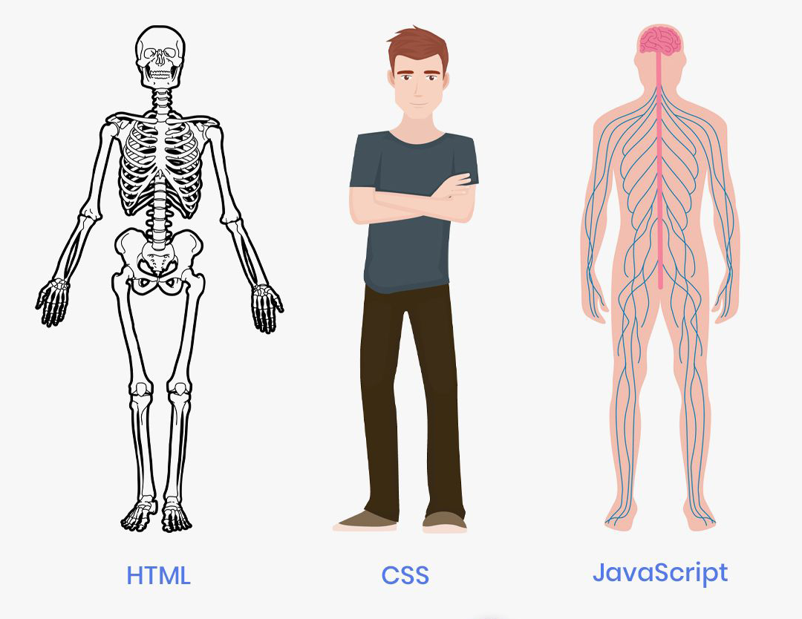

# README: Introduction to HTML, CSS, and JavaScript

This lesson provides an introduction to HTML (Hypertext Markup Language), CSS (Cascading Style Sheets), and JavaScript, the three fundamental technologies used for building dynamic and interactive websites.

## Table of Contents

- [Introduction to HTML](#introduction-to-html)
- [Introduction to CSS](#introduction-to-css)
- [Introduction to JavaScript](#introduction-to-javascript)
- [Conclusion](#conclusion)

## Introduction to HTML

HTML is the standard markup language used for creating the structure and content of web pages. In this section, you will learn the basics of HTML, including the document structure, tags, elements, text formatting, links, images, lists, tables, and forms. HTML provides the foundation for web development and serves as the backbone of any webpage.

## Introduction to CSS

CSS is a stylesheet language that allows you to style and present the HTML content. In this section, you will explore the fundamentals of CSS, including selectors, properties, values, box model, layouts, colors, typography, and media queries. CSS enables you to control the visual aspects of your web pages, including the layout, colors, fonts, and overall design.

## Introduction to JavaScript

JavaScript is a high-level, interpreted programming language that adds interactivity and dynamic behavior to web pages. In this section, you will discover the core concepts of JavaScript, including variables, data types, operators, control flow, functions, objects, events, and DOM manipulation. JavaScript empowers you to create interactive features, handle user interactions, validate forms, make AJAX requests, and build dynamic web applications.

## Conclusion

By exploring HTML, CSS, and JavaScript, you will gain a solid foundation in web development. These technologies work together to create engaging and interactive websites. Understanding how to structure content with HTML, style elements with CSS, and add interactivity with JavaScript will allow you to build robust and visually appealing web applications.

Feel free to contribute to this repository by submitting pull requests with any improvements or corrections you may have. Happy learning!

---

